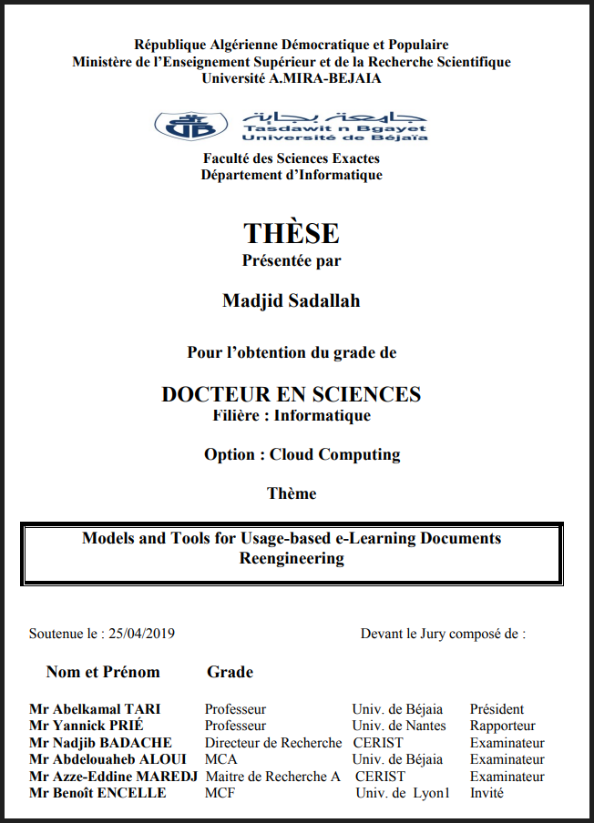
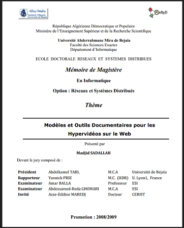

# PhD Thesis (University of Bejaia - Algeria, 2019)

* Topic: Models and Tools for Usage based e-Learning Documents Reengineering 
* Supervisor: Pr. Yannick Prié & Dr. Benoît Encelle"

<a style="color:white;cursor: pointer; cursor: hand;" href="/phd" class="btn btn--info">Details</a>

---
# Magister Thesis (University of Bejaia - Algeria, 2011)

* Topic: Models and Documentary Tools for Hypervideos on the Web. 
* Supervisor: Pr. Yannick Prié & Dr. Olivier Aubert"

<a style="color:white;cursor: pointer; cursor: hand;" href="/magister" class="btn btn--info">Details</a>

---
# Engineer Thesis (USTHB - Algeria, 2004)
* Topic: Edge Detection Algorithms: towards an automatic selector of an optimal detection operator
* Supervisor: Dr. Samy Ait-Aoudia"

